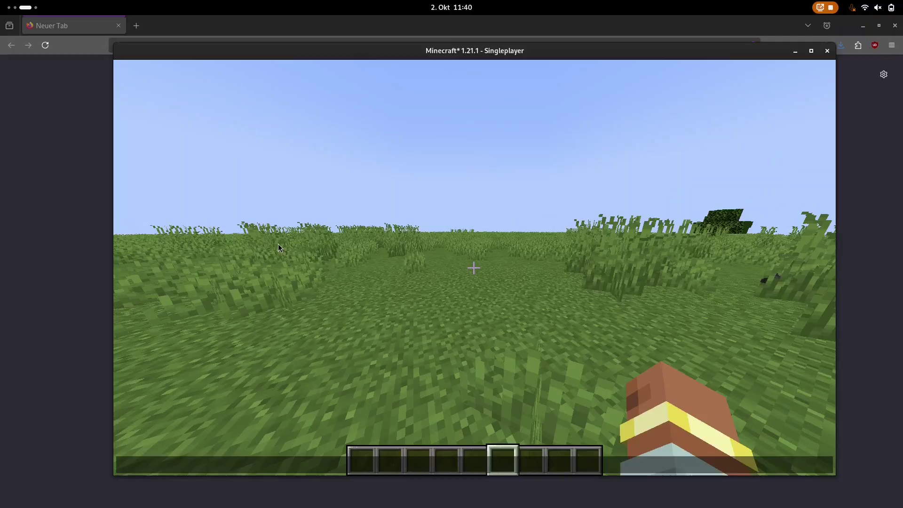

# What is this mod?
Its a very simple 2 hour mod to enable nbt creation in 1.21.1

It is mainly intended for just importing and exporting nbt into and from minecraft. The main creational work is intended to happen fully outside minecraft with a code editor or [MCStacker](https://mcstacker.net/) or so.

# How do I use it?
You need [farbic](https://fabricmc.net/) version 1.21.1 and [fabric-api](https://modrinth.com/mod/fabric-api/) 1.21.1.

Once installed, you will have the following chat commands at your disposal

- `.nbt [show]` where show is optional.
This will show you the nbt of the item you are currently holding.

- `.nbt copy` which copies the nbt of the item you are holding to your clipboard.

- `.nbt paste', which will attempt to create an item from the nbt data in your clipboard.
Note that because 1.21.1 changed a lot about how to format /give commands, it is supported, but with some annoying quirks. (Because trying to work around them would be a lot of work, and I really cannot be bothered).

If you want to use /give to create an item (for example, using [MCStacker](https://mcstacker.net/)), the item you are giving yourself **MUST** be in a decorated pot, and the command **MUST** be in the following format

/give @p decorated_pot[container=[{slot:0,item:`<Your NBT HERE>`}]] 1

which is also the format used by [MCStacker](https://mcstacker.net/) to put items into containers.

Below is a video example of how to use all these features.

If you have any questions or problems feel free to ask on my [discord](discord.gg/2zyG7DP4PZ).

# Showcase-Video
